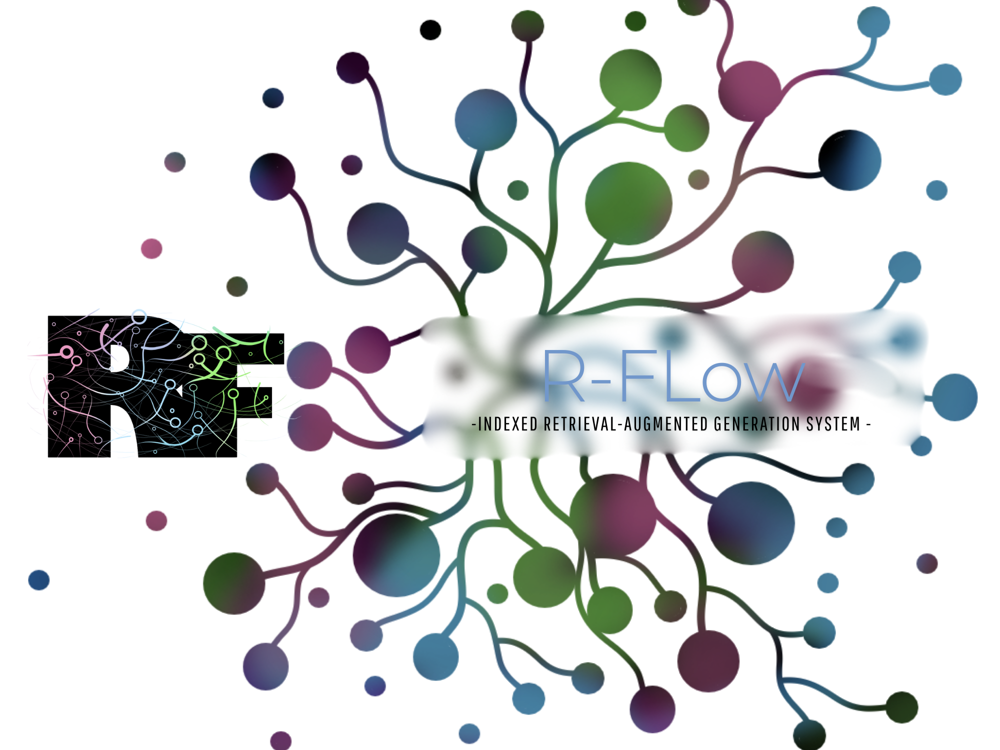

# R-Flow - Indexed Retrieval-Augmented Generation System -

🌍[DEMO](https://ai-ragflow.com/)
## 📖 Table of Contents
- 📝[Introduction](#introduction)
- 📊[Features](#features)
- 📂 [Project Structure](#project-structure)
- 🔧[ Setup Instructions](#setup-instructions)
  - [Clone the Repository](#clone-the-repository)
  - [Install Dependencies](#install-dependencies)
  - [Configure Environment Variables](#configure-environment-variables)
  - [Download Dataset](#download-dataset)
  - [Check Data Structure](#check-data-structure)
  - [Obtain API Key](#obtain-api-key)
- ✅[Usage](#usage)
  - [Ingest Data](#ingest-data)
  - [Create Embedding](#create-embedding)
  - [Build Search Engine](#build-search-engine)
  - [Process Queries](#process-queries)
- ⚙️[Customization](#customization)
- 📜[License](#license)
- 🤝[Contributor](#contributor)
- 📬[Contact](#contact)
## Introduction
### Motivation

Current RAG presents several issues:

### Problems:
#### Dependency on Retrieval Quality:
- The system’s performance largely hinges on the external knowledge base. If the documents or data retrieved are irrelevant, outdated, or low quality, the generated responses can suffer in accuracy and reliability.

#### Integration Complexity:
- Combining a language model with a retrieval system adds architectural complexity. Ensuring smooth integration between the two components—especially keeping the retrieval and generation parts in sync—can be challenging.

#### Latency Issues:
- The extra step of fetching relevant information from an external source can introduce delays. Although this can be mitigated with efficient indexing and caching.

#### Maintenance of the Knowledge Base:
- RAG relies on a maintained external repository. Regular updates, curation, and quality control are necessary to ensure that the retrieval component remains effective, which adds an operational burden.

#### Fallback Handling:
- In cases where the retrieval system fails to find relevant data, the model may revert to its base, possibly outdated, knowledge. This can lead to incomplete or less informed responses.

### Solution:
#### This project is a **Retrieval-Augmented Generation (RAG) system** designed to handle large datasets, specifically for **legal text analysis and retrieval**. It leverages:
- **MongoDB** for document storage and retrieval.
- **OpenAI embeddings** for semantic search.
- **Annoy-based vector search** for efficient similarity-based matching.

## Features
### 🔹 Key Features
-  **No Hallucination** – By restricting searches to a **local domain**, we drastically lower the chances of misinformation.
-  **High Accuracy** – Utilizing the **latest OpenAI embedding model**, we aim to surpass existing solutions in precision and relevance.
-  **Optimized API Usage** – By caching and saving search queries and keep the embedding in the storage, we **reduce API costs** while maintaining efficient retrieval.
-  **Fast Search Engine** – By using the prebuild annoy index, we **reduce the time of search** .

### 💡 How It Works
- Preprocess Large Datasets : Loads and processes structured or unstructured data.
- Generate & Store Embeddings : Uses ChatGPT embeddings and saves them locally for vector-based search.
- Efficient Retrieval & Augmentation : Quickly fetches relevant data using an optimized vector search engine.
- ChatGPT-Powered Responses : The system refines retrieved results and generates intelligent, context-aware responses.
- API Optimization : By caching embeddings and search results, the system reduces redundant API calls.

### 🔹 Data Processing & Storage
- Data Ingestion – Reads and loads structured/unstructured documents from a JSONL file into MongoDB.
-  Embedding Generation – Uses OpenAI's embedding API to convert text into high-dimensional vector representations for efficient search.

### 🔍 Intelligent Search & Retrieval
-  Vector Search – Employs Annoy (Approximate Nearest Neighbors) for fast and scalable vector-based document retrieval.
-  Similarity Ranking – Uses cosine similarity to rank and filter the most relevant documents based on the user query.

### 🧠 AI-Powered Summarization
- Context-Aware Summarization – Extracts insights from the top 10 retrieved cases and summarizes results using ChatGPT.

### ⚙️ Modular Architecture 
- Data Ingestion: Reads documents and stores them in MongoDB.
- Embedding Generation: Uses OpenAI's embedding API to convert text into high-dimensional vectors.
- Search Emgine: Utilizes Annoy for efficient, approximate nearest neighbor searches.
- Similarity Ranking: Applies cosine similarity to filter and rank relevant documents.
- Summarization: Summarizes the top 10 retrieved cases using ChatGPT.


## Project Structure
```py
AI-RAG-FLOW-AI-Powered-Datawharehouse-System-/
├── .env                          # Environment variables file 
├── config.py                     # Python configuration file 
├── requirements.txt              # List of Python dependencies
├── main.py                       # Main testing script 
├── db.py                         # Database handler&related functions
├── openai_service.py             # OpenAI service
├── annoySearch.py                # Search using annoy index
├── preprocess/
│   ├── __init__.py               
│   ├── ingest_Australian_Legal_Corpus.py
│   ├── ingest_us_constitution.py   # Script to ingest 
│   ├── build_searchengine.py       # Script to build the Annoy index 
│   └── update_corpus_embeddings.py # Script to update embeddings in DB
├── Corpus/
│   ├──  Us_Constitution.json
│   └──  Open_Australian_Legal_Corpus.jsonl
└── annoy/
    ├── usc.ann                 # Annoy index file 
    ├── usc_id_map.pkl          # ID map for the Annoy index file 
    ├── auslaw.ann                # Annoy index file 
    └── aus_id_map.pkl            # ID map for the Annoy index file 
```
## Setup Instructions
### 1. 🖥️ Clone the Repository

```bash
git clone https://github.com/yourusername/vector-rag-system.git
cd vector-rag-system
```
### 2. 📦 Install Dependencies

Ensure you have Python installed, then run:
```bash
pip install -r requirements.txt
```
If you do not have MongoDB:
🔗 [Install MongoDB](https://www.mongodb.com/docs/manual/installation/)
### 3. 🔧 Configure Environment Variables

Create a .env file in the project root with the following content:

```bash
OPENAI_API_KEY=your_openai_api_key_here # Get OpenAI'API 
MONGO_URI=mongodb://localhost:27017/   # Local 
EMBEDDING_MODEL=text-embedding-3-large # The latest model
EMBEDDING_DIMENSIONS=3072             # This is the configuration of text-embedding-3-large
AUSLEGAL_DOCUMENT_PATH=./Corpus/Open_Australian_Legal_Corpus.jsonl # pre processed data set
USCON_DOCUMENT_PATH=./Corpus/Us_Constitution.json # pre processed data set

```
### 4. 📂 Download Dataset
- Once downloaded, place it under Corpus folder under the project folder
#### Open Australian Legal Corpus, available on Kaggle:🔗 [Open Australian Legal Corpus](https://www.kaggle.com/datasets/umarbutler/open-australian-legal-corpus)
#### Constitution ofthe United States:🔗 [Constitution ofthe United States](https://www.kaggle.com/datasets/yutomori2/constitution-of-the-united-states/data)
### 5. 🔍 Check Data Structure of the dataset in config.py
```bash
COLLECTION = {
    "US_CONSTITUTION_SET": {
        "db_name": DB_NAME ,
        "query_collection_name": QUERY_COLLECTION_NAME,
        "embedding_collection_name": "us_constitution_embedding", # For Annoy Indexing
        "annoy_collection_name": "us_constitution_annoy", # For Search
        "annoy_index_path": "./annoy/usc.ann",
        "id_map_path": "./annoy/usc_id_map.pkl",
        "document_type": "US Constitution",  # Type of the document
        "unique_index": "title"
    },
    "AUS_LAW_SET": {
        "db_name": DB_NAME,
        "query_collection_name": QUERY_COLLECTION_NAME,
        "embedding_collection_name": "Australia_Law_2024_embedding", # For Annoy Indexing
        "annoy_collection_name": "Australia_Law_2024_annoy", # For Search
        "annoy_index_path": "./annoy/auslaw.ann",
        "id_map_path": "./annoy/aus_id_map.pkl",
        "document_type": "Australia Laws 2024",  # Type of the document
        "unique_index": "version_id"
    }
}
```
### 6. 💰 Obtain API key
### 💰 Obtain API key from [OpenAI'API](https://openai.com/api/)

## Usage

### 1. 🔄 Ingest Data
- Each Parsing needs to be implmented beforehand, then load your JSONL data into MongoDB by running:
#### Input
```bash
python -m preprocess.ingest_Us_constititon # For US_Consitiotion
# python -m preprocess.ingest_Australian_Legal_Corpus # For Australian law
# Or Make own Ingest script for MongoDB (At least one unique id is required such as title, version id, etc)
```
#### Output
```bash
[INFO] Connected to MongoDB with write concern w=0.
[INFO] Indexes dropped temporarily.
[INFO] Found 52 documents with a title.
[INFO] Found 0 existing titles in the collection.
[INFO] Inserted 52 new documents using bulk unordered insert.
[INFO] Re-created unique index on 'title'.
[INFO] JSON data ingestion complete.
[INFO] Processed: 52 new documents.
[INFO] Skipped: 0 documents with missing 'title' or duplicates.
[INFO] MongoDB connection closed.
```
### 2. 📊 Create Embedding 
- Create Embedding and inserto the database using OpenAI's embedding. optinally sentense transformer can be used
#### Input
```bash
python -m preprocess.update_embedding
```
#### Output
```bash
Generating embedding for text...
[INFO] HTTP Request: POST https://api.openai.com/v1/embeddings "HTTP/1.1 200 OK"
Embedding generated.
```
### 3. 🏗️ Build Search Engine
- Buidling the annoy index for each collection separatly, we will load each of he annoy as search engine.
#### Input
```bash
python -m preprocess.build_searchEngine
```
#### Output
```bash

[INFO] Available configurations:
[INFO] 1: US Constitution
[INFO] 2: Australia Laws 2024
[INFO] Enter configuration number: 1
[INFO] Using configuration: US Constitution
[INFO] Selected configuration details: {
    "db_name": "ai_rag_db",
    "query_collection_name": "User_queries",
    "embedding_collection_name": "us_constitution_embedding",
    "annoy_collection_name": "us_constitution_annoy",
    "annoy_index_path": "./annoy/usc.ann",
    "id_map_path": "./annoy/usc_id_map.pkl",
    "document_type": "US Constitution",
    "unique_index": "title"
}
[INFO] ANNOY_INDEX_PATH: ./annoy/usc.ann
[INFO] ID_MAP_PATH: ./annoy/usc_id_map.pkl
[INFO] Fetched 52 documents with embeddings from 'us_constitution_embedding'.
[INFO] Annoy index built and saved to ./annoy/usc.ann
[INFO] ID map saved to file: ./annoy/usc_id_map.pkl
[INFO] Cleared previous documents from collection 'us_constitution_annoy'.
[INFO] Inserted 52 documents into 'us_constitution_annoy'.
[INFO] MongoDB connection closed.
```
### 4. ⚡ Process Queries
- Creat main.py Launch the main application to handle user queries:
#### Example:
```python
# main.py
import json
from DatabaseHandler import DatabaseHandler
from openai_service import ChatGPT
from config import COLLECTION

def display_more_details(case):
    """
    Prints additional details about a case, excluding '_id' and 'map_id'.
    """
    print("\n--- More Details ---")
    for key, value in case.items():
        if key not in ["_id", "map_id"]:
            print(f"{key}: {value}")
    print("--- End Details ---\n")


def main():
    # List available configurations from COLLECTION.
    keys = list(COLLECTION.keys())
    print("Available configurations:")
    for i, key in enumerate(keys, start=1):
        doc_type = COLLECTION[key].get("document_type", "Unknown")
        print(f"{i}: {doc_type}")
    
    # Let the user choose a configuration by number.
    try:
        selected_num = int(input("Enter configuration number: ").strip())
        if selected_num < 1 or selected_num > len(keys):
            raise ValueError("Selection out of range")
    except Exception as e:
        print("Invalid configuration number. Defaulting to 1.")
        selected_num = 1

    config = COLLECTION[keys[selected_num - 1]]
    print(f"Using configuration: {config['document_type']}")
    print("Selected configuration details:")
    print(json.dumps(config, indent=4))
    
    # Instantiate the DatabaseHandler and ChatGPT service.
    db_handler = DatabaseHandler(config)
    chat_service = ChatGPT(db_handler.db)
    
    last_query_results = None
    current_idx = 0
    
    while True:
        user_input = input("Enter a query, 'next' for next result, 'more' for details, or 'exit': ").strip().lower()
        if user_input == "exit":
            break
        elif user_input == "next":
            if not last_query_results:
                print("No previous query found. Please enter a new query first.")
                continue
            if current_idx >= len(last_query_results):
                print("No more results for this query. Enter a new query.")
                continue
            case, similarity = last_query_results[current_idx]
            current_idx += 1
        elif user_input == "more":
            if not last_query_results or current_idx == 0:
                print("No result available for more details. Enter a query first.")
                continue
            # Show details for the last returned case (previous index).
            case, similarity = last_query_results[current_idx - 1]
            display_more_details(case)
            continue
        else:
            # Process a new query.
            print("Processing query...")
            last_query_results, processed = db_handler.process_query(user_input)
            if not processed:
                print("Daily search limit reached. Exiting.")
                break
            if not last_query_results:
                print("No results found. Try another query.")
                continue
            current_idx = 0
            case, similarity = last_query_results[current_idx]
            current_idx += 1

        # Generate and display a summary for the current case.
        summary = chat_service.summarize_cases(case)
        print(f"\nSummary (Similarity: {similarity:.2f}):\n{summary}\n")
    db_handler.close() # Close the connection
    print("Goodbye!")

if __name__ == "__main__":
    main()
```
#### Input
```bash
python main.py
```
#### Output
```
Available configurations:
1: US Constitution
2: Australia Laws 2024
Enter configuration number: 1
Using configuration: US Constitution
Selected configuration details:
{
    "db_name": "ai_rag_db",
    "query_collection_name": "User_queries",
    "embedding_collection_name": "us_constitution_embedding",
    "annoy_collection_name": "us_constitution_annoy",
    "annoy_index_path": "./annoy/usc.ann",
    "id_map_path": "./annoy/usc_id_map.pkl",
    "document_type": "US Constitution",
    "unique_index": "title"
}
[INFO] Annoy index loaded from ./annoy/usc.ann
[INFO] ID map loaded from ./annoy/usc_id_map.pkl
[INFO] Annoy index and ID map loaded successfully.
[INFO] DatabaseHandler initialized with configuration: US Constitution
Enter a query, 'next' for next result, 'more' for details, or 'exit': most important right
Processing query...
[INFO] User query: most important right
[INFO] Querying...
[INFO] Today's date: 2025-03-04
[INFO] Usage of today: 15
[INFO] Generating embedding for text...
[INFO] HTTP Request: POST https://api.openai.com/v1/embeddings "HTTP/1.1 200 OK"
[INFO] Embedding generated.
[INFO] Today's date: 2025-03-04
[INFO] Updated usage of today to 16.
[INFO] Stored new query embedding in MongoDB.
[INFO] Searching in the vector database for up to 10 results.
[INFO] Searching for similar documents...
[INFO] Annoy returned 10 indices.
[INFO] Search complete. 1 documents returned.
[INFO] Query: most important right | Document [title]: First Amendment | Similarity: 0.43
[INFO] Generating summary for case with title: First Amendment
[INFO] HTTP Request: POST https://api.openai.com/v1/chat/completions "HTTP/1.1 200 OK"
[INFO] Summary generated successfully for case with _id: 67c6ba0c21385f76c48478de
[INFO] Updated summary in database for case with _id: 67c6ba0c21385f76c48478de
[INFO] Today's date: 2025-03-04
[INFO] Usage of today: 31
[INFO] Today s date: 2025-03-04
[INFO] Updated usage of today to 32.

Summary (Similarity: 0.43):
This excerpt is from the First Amendment to the United States Constitution, which outlines several fundamental rights and freedoms. It prohibits Congress from enacting legislation that establishes any religion or impedes the free practice of religion. Additionally, it safeguards freedoms related to speech, the press, peaceful assembly, and the right to petition the government to address grievances.

Top Insights:
1. **Religious Freedom**: The First Amendment ensures both the prevention of a government-mandated religion and the protection of individuals' rights to practice religion as they choose.
2. **Freedom of Speech and Press**: These freedoms are crucial for a democratic society, allowing individuals to express themselves and share information without undue government interference.
3. **Right to Assemble and Petition**: Citizens have the right to gather peacefully and to seek governmental changes, which supports public participation in democracy and accountability from elected officials.

Enter a query, 'next' for next result, 'more' for details, or 'exit': more

--- More Details ---
article: Amendment
section:
title: First Amendment
text: Congress shall make no law respecting an establishment of religion, or prohibiting the free exercise thereof; or abridging the freedom of speech, or of the press; or the right of the people peaceably to assemble, and to petition the Government for a redress of grievances.
summary: This excerpt is from the First Amendment to the United States Constitution, which outlines several fundamental rights and freedoms. It prohibits Congress from enacting legislation that establishes any religion or impedes the free practice of religion. Additionally, it safeguards freedoms related to speech, the press, peaceful assembly, and the right to petition the government to address grievances.

Top Insights:
1. **Religious Freedom**: The First Amendment ensures both the prevention of a government-mandated religion and the protection of individuals' rights to practice religion as they choose.
2. **Freedom of Speech and Press**: These freedoms are crucial for a democratic society, allowing individuals to express themselves and share information without undue government interference.
3. **Right to Assemble and Petition**: Citizens have the right to gather peacefully and to seek governmental changes, which supports public participation in democracy and accountability from elected officials.
--- End Details ---

Enter a query, 'next' for next result, 'more' for details, or 'exit': exit
Goodbye!
```

## Customization
- Embedding Model: Change the EMBEDDING_MODEL in your .env file to use a different OpenAI model or Localy compute using sentenceTransformer if needed.
- MongoDB Configuration: Adjust the MONGO_URI in your .env file to connect to a different MongoDB instance.
- Annoy Settings: Tweak parameters such as VECTOR_SIZE and ANNOY_TREE_COUNT in build_searchEngine.py to suit your data and - performance requirements.
- Summarization Prompt: Modify the prompt in summarizer.py to tailor the summarization output.
- More Database: To add more custmize data follow the each step:   
  1. [Check Data Structure of the dataset in config.py and add the dataset](#download-dataset)
  2. [Ingest Data](#ingest-data)
  3. [Create Embedding](#create-embedding)
  4. [Build Search Engine](#build-search-engine)
 
- Other Configuration: 
  - THRESHOLD_QUERY_SEARCH - Threshold of the cosine simialrity of the search
  - TOP_QUERY_RESULT - Number of query retiriveted at once
  - LIMIT - limit of the query per day

## License
#### This project is licensed under the Apache License 2.0.

## Contributer
### Logo Designer: Ambre Grimault 
### Tester: 
## Contact
Contributions, issues, and feature requests are welcome! Please check the issues page for known issues and to submit new ones.
#### 📧Email: yutomoridm@gmail.com
